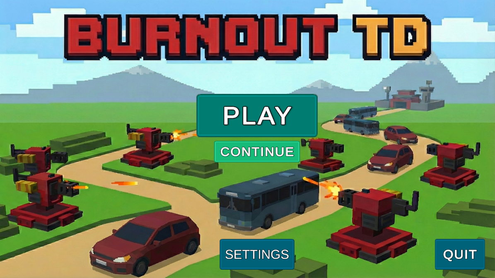
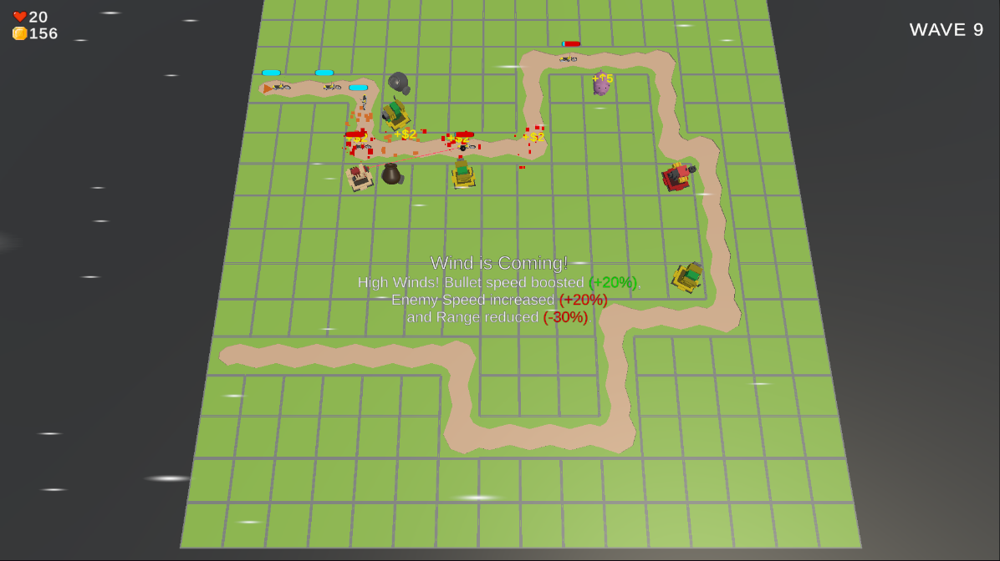

Burnout Tower Defense

* A 3D Tower Defense game featuring a real-time dynamic weather system, built with Unity & C# for SE320 course.

About The Project
This project explores modular game architecture using **ScriptableObjects** and advanced **C#** logic. Unlike traditional tower defense games, this project introduces a **Dynamic Weather System** (Rain, Fog, Wind, Earthquake) that changes gameplay physics and strategy in real-time.

Key Features
* Dynamic Weather System: Random events (Fog, Rain, Earthquake) change enemy speed and tower range during waves.
* Modular Architecture: Data-driven design using Unity's ScriptableObjects for easy balancing.
* Contextual UI: Smart menu system that prevents raycast conflicts.
* Optimization: High-performance pathfinding and object pooling techniques.

Built With
* [Unity]
* [C#] - Language

Screenshots
| Main Menu | Gameplay |
|  |  |

How to Play
1. Clone the repo: git clone https://github.com/berkeikikarakayali/tower_defense.git
2. Open in Unity: Open the project folder using Unity Hub (Version 6000.0.058f2 recommended).
3. Play: Open Assets/Scenes/MainMenu.unity and hit Play.

Credits
* Developer: Berke İkikarakayalı
* Assets: Low Poly Cars (Broken Vector), Tower Pack (Lindou).
